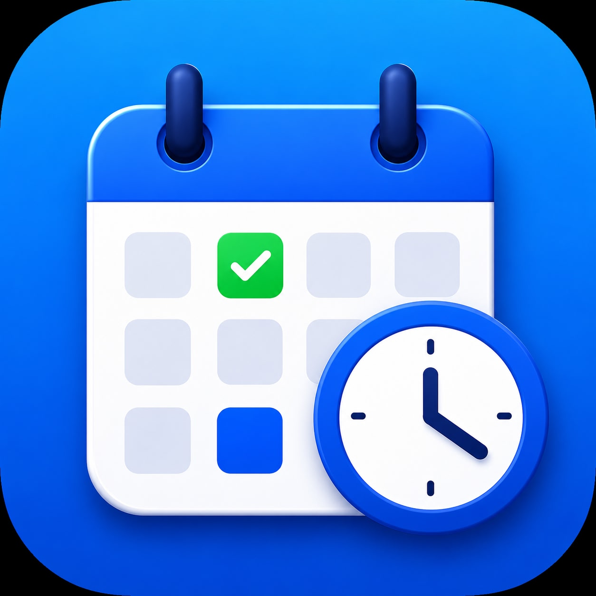

# MeRota Planner

<p align="center">
  
</p>

<h3 align="center">A modern shift planner and earnings tracker for healthcare professionals, support workers, nurses, carers, and shift-based employees.</h3>

---

## 📱 About

MeRota Planner is a professional mobile application designed to simplify shift management, working hour tracking, and earnings estimation.

Whether you work day shifts, night shifts, bank shifts, weekends, or rotating schedules, MeRota Planner helps you stay organised and accurately estimate your income before payday.

Built with **React Native (Expo)**, the app provides a clean, modern, and intuitive experience while storing your data securely on your device.

---

## ✨ Features

- 📅 Monthly shift calendar
- 🕒 Day, Night, Holiday and Sick shift support
- 💷 Estimated earnings calculator
- ⏱ Automatic working hours calculation
- 🍽 Break deduction support
- ⚙ Custom hourly pay settings
- 📊 Dashboard with shift summary
- 📆 Monday–Sunday calendar layout
- 📝 Shift notes
- 📱 Clean and modern user interface
- 💾 Offline local storage
- 🔒 Private and secure data storage
- 🚀 Fast and lightweight performance

---

## 📸 Screenshots

Add your App Store screenshots here.

| Dashboard | Calendar | Add Shift | Pay Settings |
|-----------|----------|-----------|--------------|
| Screenshot | Screenshot | Screenshot | Screenshot |

---

## 🛠 Built With

- React Native
- Expo
- Expo Router
- JavaScript
- React Native Calendars
- SQLite
- AsyncStorage

---

## 📂 Project Structure

```
MeRotaPlanner/
│
├── app/
├── assets/
├── components/
├── constants/
├── database/
├── styles/
├── utils/
├── package.json
├── app.json
└── README.md
```

---

## Installation

Clone the repository

```bash
git clone https://github.com/Gideon-Mensah/merota-planner.git
```

Navigate into the project

```bash
cd merota-planner
```

Install dependencies

```bash
npm install
```

Start the development server

```bash
npx expo start
```

Run on iOS

```bash
npx expo run:ios
```

Run on Android

```bash
npx expo run:android
```

---

## App Store

MeRota Planner is available on the **Apple App Store**.

**Download here:**

https://apps.apple.com/app/id6776914060

---

## Roadmap

Future updates include:

- Cloud backup & sync
- Face ID / Touch ID protection
- Shift reminders & notifications
- Dark Mode
- PDF shift reports
- CSV export
- Apple Watch support
- Overtime calculations
- Multiple job profiles
- iCloud synchronisation

---

## Contributing

Contributions, feature requests, and suggestions are welcome.

If you have ideas to improve MeRota Planner, feel free to open an issue or submit a pull request.

---

## Author

**Gideon Owusu Agyei Mensah**

GitHub:
https://github.com/Gideon-Mensah

---

## Support

If you enjoy using MeRota Planner, please consider:

- ⭐ Starring this repository
- 📱 Downloading the app from the App Store
- 📝 Leaving an App Store review

Your support helps improve the project and future releases.

---

## License

This project is provided for educational and portfolio purposes.

All rights reserved © Gideon Owusu Agyei Mensah.
